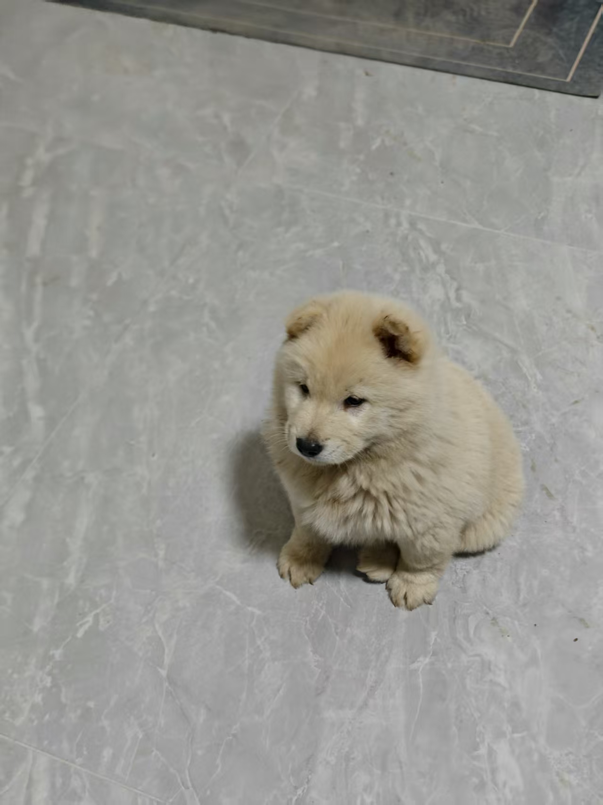
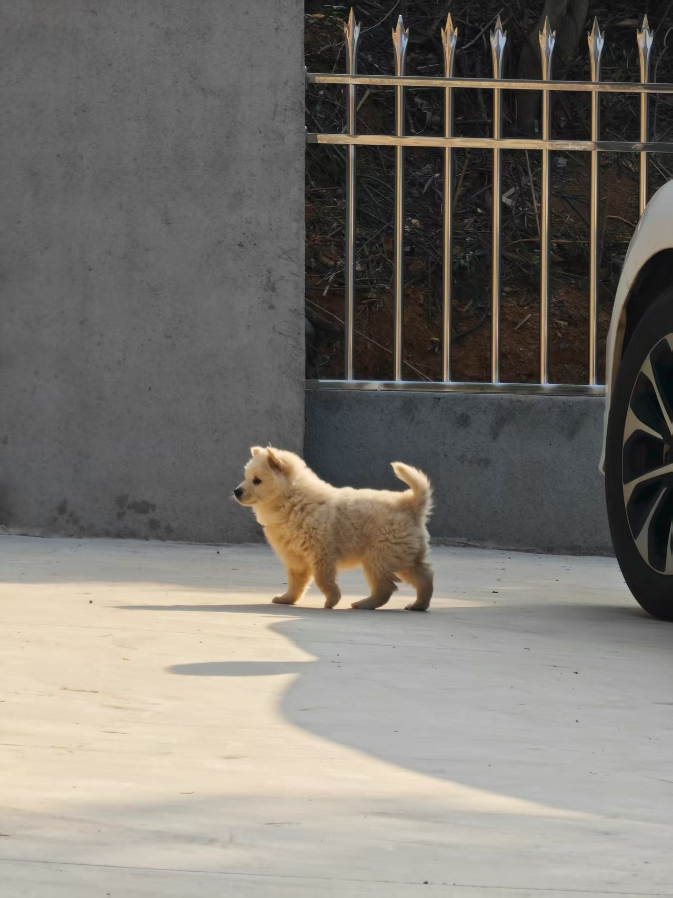
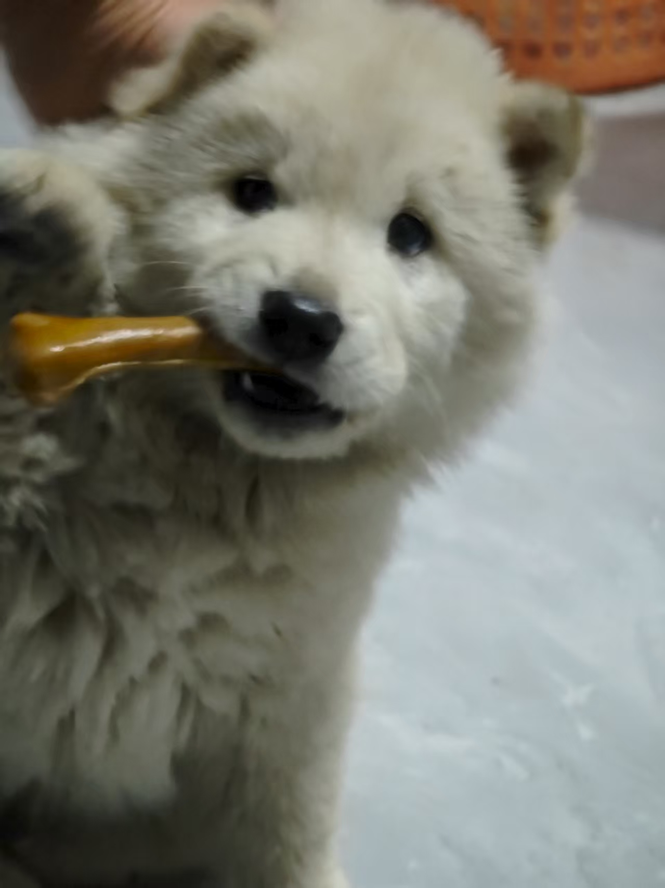
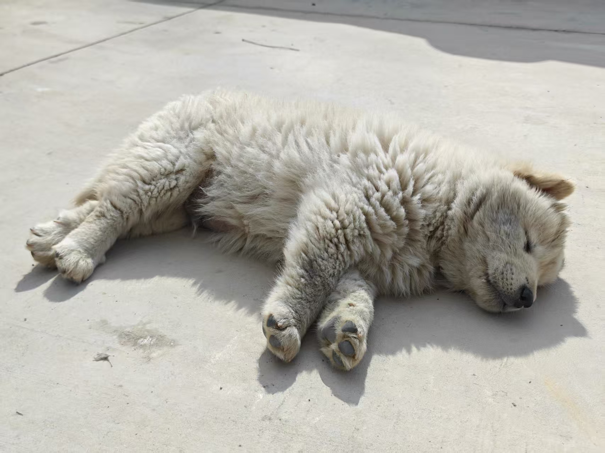
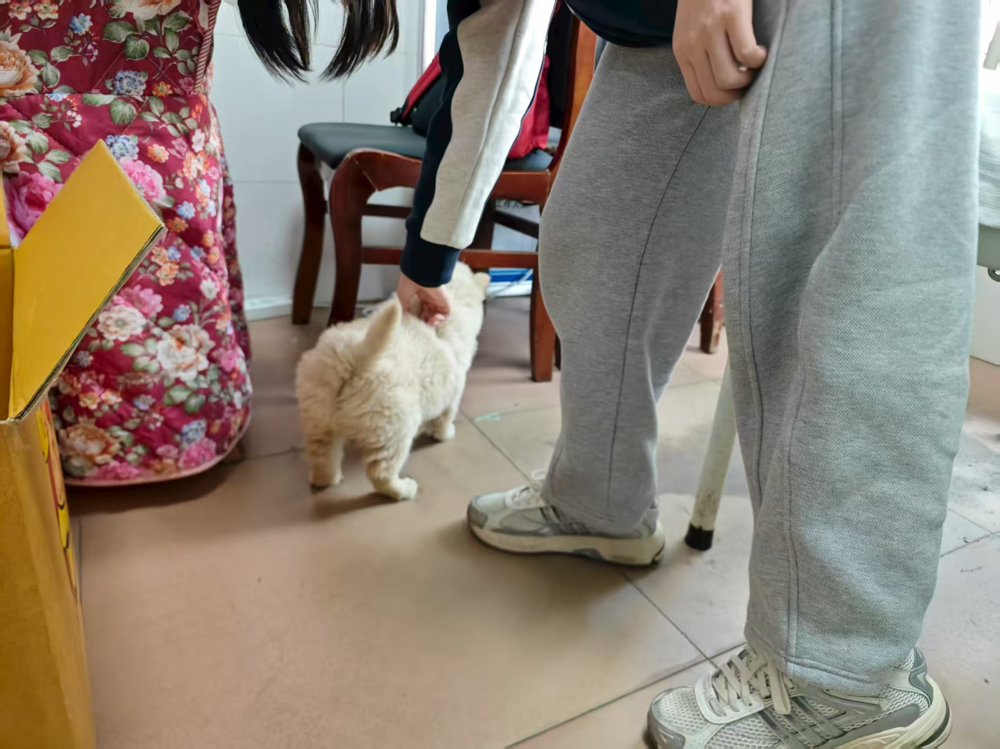
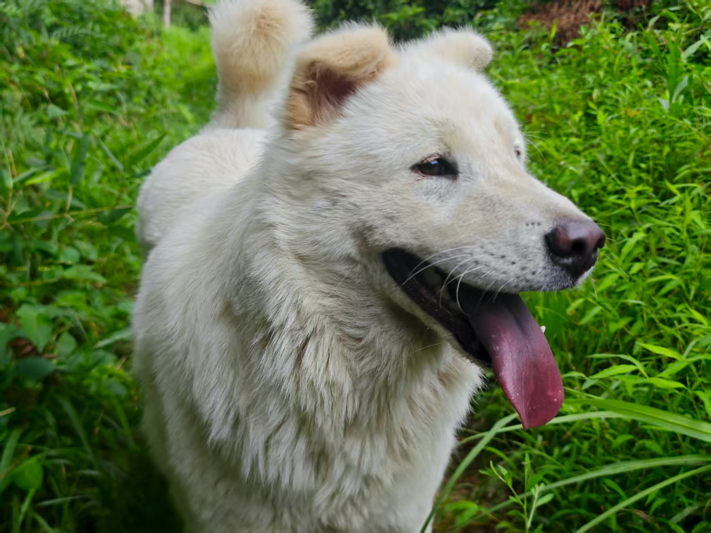

## Sports & Fitness 🏃‍♂️
- **Basketball** 🏀 (23 is my favorite number)
- **Running** 🏃‍♂️ (Chinese national second-level 100m sprinter)
- **Fitness** 💪 (Half squat max: 200kg)
- **Swimming** 🏊‍♂️

## Gaming 🎮
- **Counter-Strike 2** 🔫 (I love niko)
- **Minecraft** ⛏️ (Playing since childhood)
- **Grand Theft Auto Series** 🚗 (GTA6 is coming soon)

## Other Interests 🌟
- **Cooking** 👨‍🍳 (I'm improving!)
- **Small Animals** 🐾 (Especially dogs and cats)

## My Dog 🐕💗
Meet my little pup! My girlfriend and I decided to call him Happy – we're hoping he'll live up to his name and stay healthy and joyful for years to come! He's a Chinese Tusong dog 🐕, one of those wonderful traditional breeds that have been loyal companions in China for generations.

  
  
  
  
  
  

